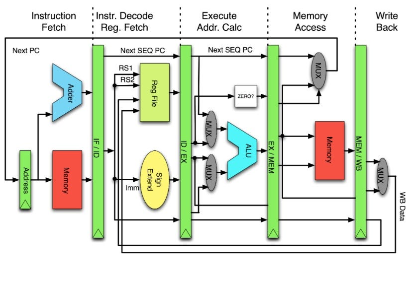
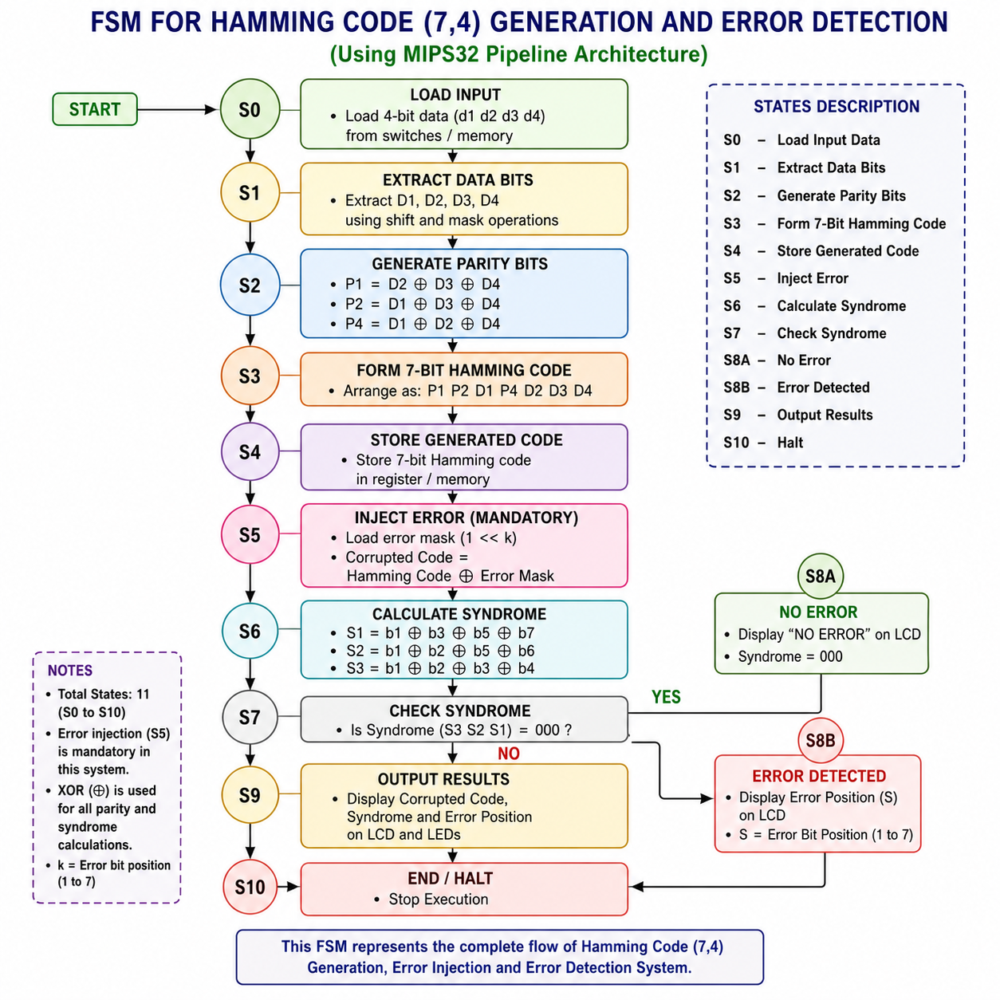

# Hamming Code (7,4) Generation and Error Detection using a 5-Stage MIPS32 Pipeline Processor

## Overview

This project implements **Hamming Code (7,4) generation** and **single-bit error detection** using a custom **5-stage pipelined MIPS32 processor** designed in **Verilog HDL**. The processor executes MIPS32 assembly programs to generate parity bits, form the 7-bit Hamming code, inject a controlled error, calculate syndrome bits, and identify the erroneous bit position.

The complete system was designed, simulated using **Xilinx ISE**, and validated on a **Spartan-6 FPGA** using LEDs and an LCD display.

---

# Features

- 5-stage pipelined MIPS32 processor
- Hamming Code (7,4) generation
- Single-bit error detection
- Syndrome calculation
- MIPS32 Assembly implementation
- Verilog HDL implementation
- FPGA hardware validation
- LCD and LED output
- Simulation and waveform verification

---

# MIPS32 Pipeline Architecture

The processor follows the standard five-stage MIPS32 pipeline:

## 1. Instruction Fetch (IF)

- Fetches the instruction from instruction memory.
- Updates the Program Counter.

## 2. Instruction Decode (ID)

- Decodes the instruction.
- Reads operands from the register file.
- Generates control signals.

## 3. Execute (EX)

- Performs arithmetic and logical operations.
- Executes XOR, AND, OR, SRL and SLL operations.
- Generates parity bits and syndrome values.

## 4. Memory Access (MEM)

- Reads/Writes data memory whenever required.

## 5. Write Back (WB)

- Stores the computed result back into the register file.

<p align="center">

</p>

---

# System Architecture

<p align="center">

</p>

The FSM controls every stage of Hamming code generation, error injection, syndrome calculation, and result display.

---

# Hamming Code (7,4) Theory

The Hamming Code (7,4) converts **4 data bits** into a **7-bit codeword** by adding **3 parity bits**.

| Position | 1 | 2 | 3 | 4 | 5 | 6 | 7 |
|----------|---|---|---|---|---|---|---|
| Bit | P1 | P2 | D1 | P4 | D2 | D3 | D4 |

Parity equations:

```
P1 = D1 ⊕ D2 ⊕ D4
P2 = D1 ⊕ D3 ⊕ D4
P4 = D2 ⊕ D3 ⊕ D4
```

---

# Hamming Code Generation

### Step 1

Load 4-bit input data.

### Step 2

Extract D1, D2, D3 and D4 using SRL and AND operations.

### Step 3

Generate parity bits using XOR operations.

### Step 4

Arrange bits as:

```
P1 P2 D1 P4 D2 D3 D4
```

### Step 5

Store the generated Hamming Code.

---

# Error Injection

A controlled single-bit error is introduced using XOR.

```
Corrupted Code = Generated Code XOR Error Mask
```

Steps:

1. Generate valid Hamming Code.
2. Load error mask.
3. Perform XOR.
4. Obtain corrupted code.
5. Calculate syndrome.
6. Detect error position.

---

# Syndrome Calculation

The received codeword is checked using:

```
S1 = b1 ⊕ b3 ⊕ b5 ⊕ b7
S2 = b2 ⊕ b3 ⊕ b6 ⊕ b7
S4 = b4 ⊕ b5 ⊕ b6 ⊕ b7
```

Final Syndrome:

```
Syndrome = S4 S2 S1
```

## Syndrome Interpretation

| Syndrome | Meaning |
|----------|---------|
|000|No Error|
|001|Error in Bit 1|
|010|Error in Bit 2|
|011|Error in Bit 3|
|100|Error in Bit 4|
|101|Error in Bit 5|
|110|Error in Bit 6|
|111|Error in Bit 7|

---

# Complete Hamming Code Lookup Table

| Decimal | Data | Hamming Code |
|--------:|:----:|:------------:|
|0|0000|0000000|
|1|0001|1101001|
|2|0010|0101010|
|3|0011|1000011|
|4|0100|1001100|
|5|0101|0100101|
|6|0110|1100110|
|7|0111|0001111|
|8|1000|1110000|
|9|1001|0011001|
|10|1010|1011010|
|11|1011|0110011|
|12|1100|0111100|
|13|1101|1010101|
|14|1110|0010110|
|15|1111|1111111|

---

# Hardware Used

- Spartan-6 FPGA
- Xilinx ISE Design Suite
- Verilog HDL
- MIPS32 Assembly
- LEDs
- 16×2 LCD
- DIP Switches

---

# Hardware Implementation

- DIP switches provide 4-bit input.
- The pipelined MIPS32 processor generates the Hamming code.
- Error injection is performed using an XOR mask.
- Syndrome calculation identifies the erroneous bit.
- LEDs and LCD display the generated code and detected error position.

---

# Results

## Hamming Code Generation

<p align="center">

</p>

## Error Detection

<p align="center">

</p>

## Simulation Waveforms

<p align="center">

</p>

---

# Advantages

- Detects single-bit transmission errors
- Fast execution using pipelining
- Efficient hardware utilization
- Modular Verilog design
- Real-time FPGA implementation

---

# Applications

- Digital Communication Systems
- Computer Memory Systems
- Embedded Systems
- Networking Systems
- FPGA and VLSI Design
- Wireless Communication

---

# Future Improvements

- SECDED implementation
- Multi-bit error correction
- UART interface
- RISC-V implementation
- Vivado migration

---

# Author

**Sharthak Raj**

B.E. Electronics and Communication Engineering

KLE Technological University
